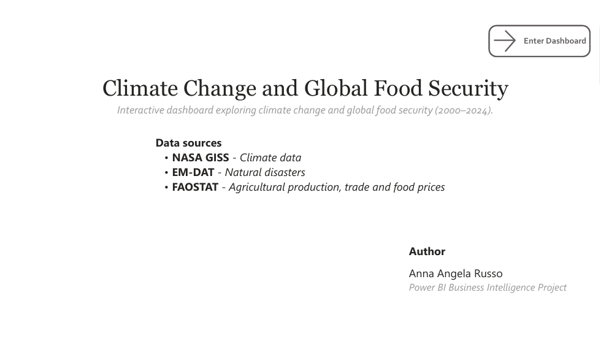
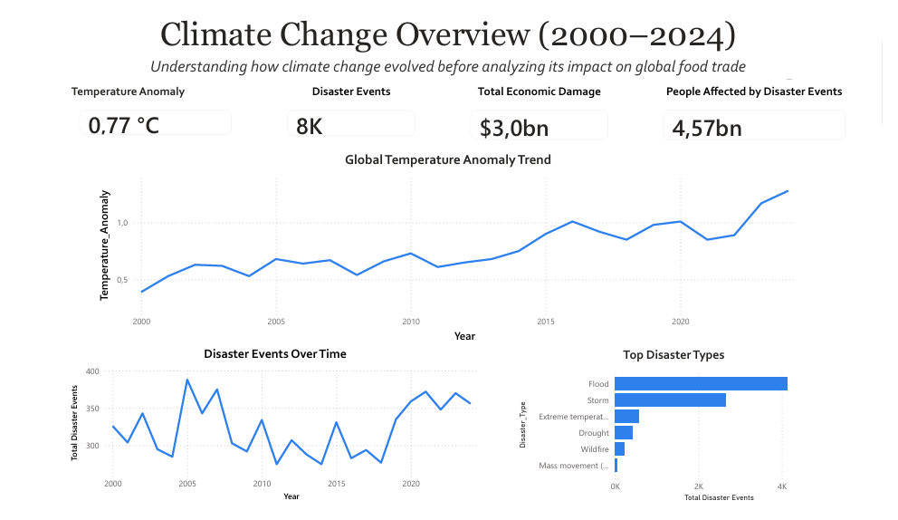
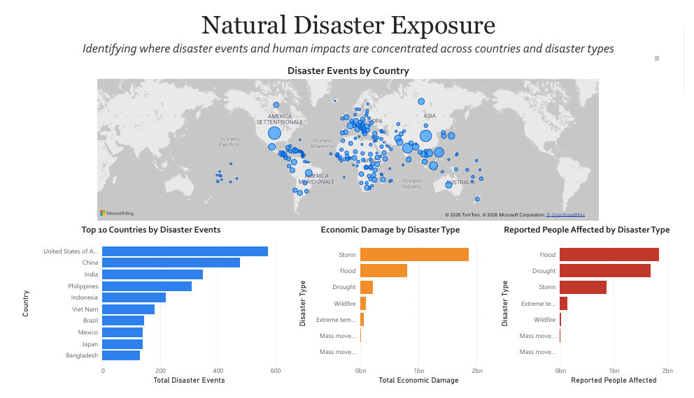
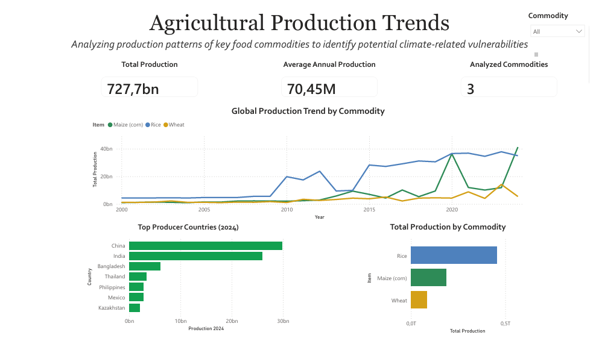
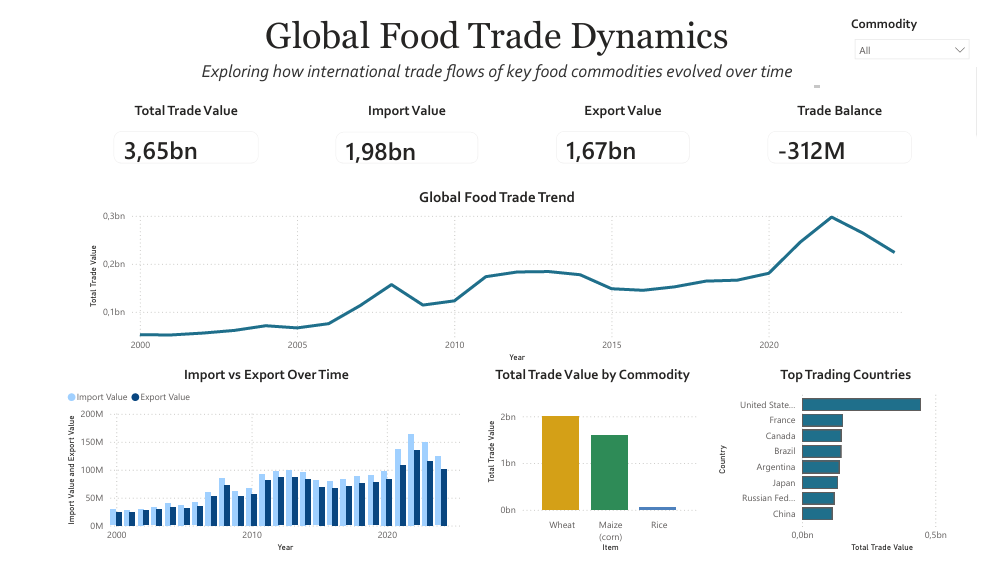
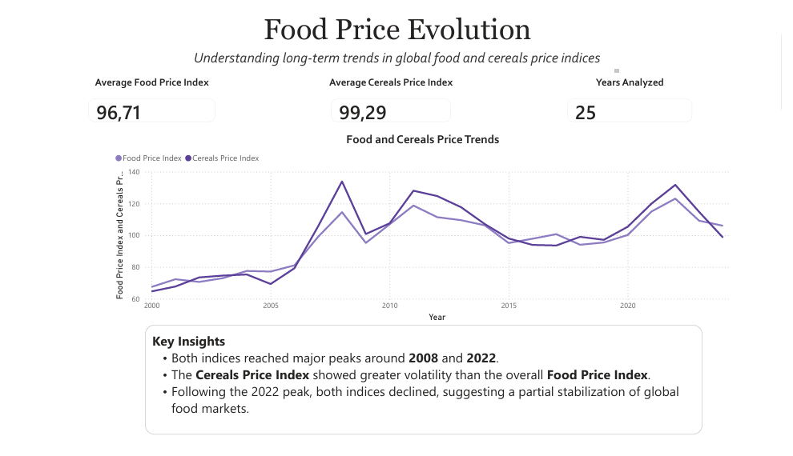
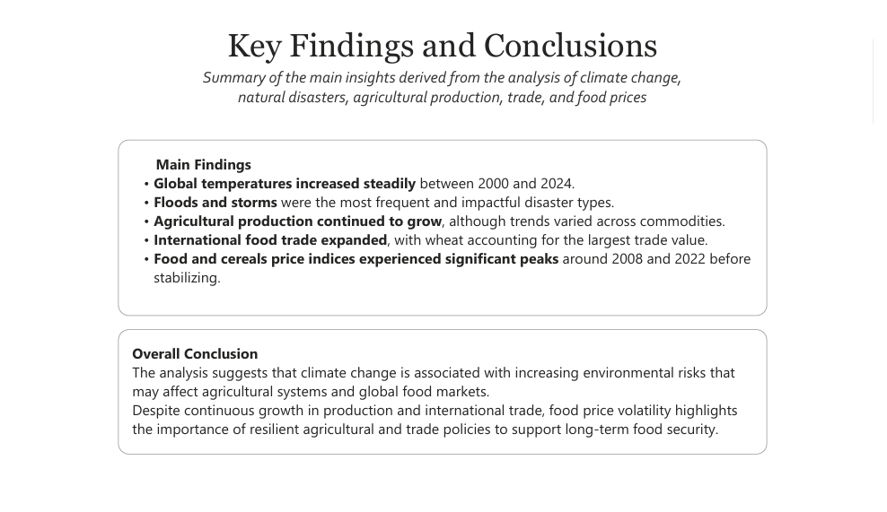
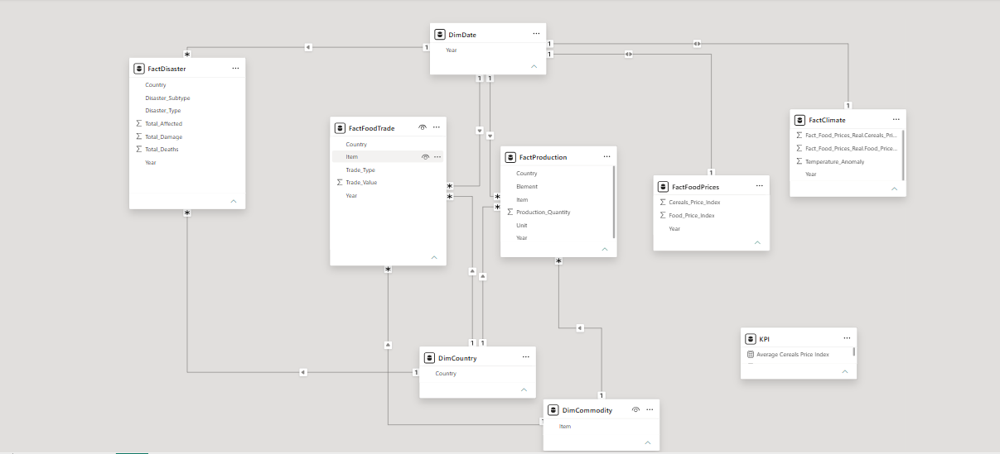

# 🌍 Climate Change and Global Food Security

> Interactive Power BI dashboard exploring climate change, natural disasters, agricultural production, international food trade and food prices (2000–2024).

---

## 📖 Project Overview

Climate change is one of the most significant global challenges, with potential implications for agriculture, food availability and international markets.

This project explores how climate indicators, natural disasters, agricultural production, food trade and food prices evolved between **2000 and 2024** through an interactive Power BI dashboard built using publicly available datasets.

> **The objective is not to establish causal relationships, but to identify historical trends, patterns and possible connections across multiple domains.**

---

## 🎯 Objectives

- Analyze global temperature trends.
- Explore the evolution of natural disasters.
- Compare agricultural production across key commodities.
- Analyze international food trade dynamics.
- Monitor food and cereals price evolution.
- Summarize the main findings through interactive dashboards.

---

## 📊 Interactive Dashboard

### 🌍 Climate Change Overview

Provides an overview of global temperature anomalies, disaster events, economic damage and affected population between 2000 and 2024.
---

### 🌪 Natural Disaster Exposure

Visualizes the geographic distribution of disaster events together with their economic and human impacts.

---

### 🌾 Agricultural Production Trends

Explores production trends of rice, maize and wheat, highlighting the leading producer countries and commodity distribution.

---

### 🚢 Global Food Trade Dynamics

Analyzes international trade dynamics through import, export and total trade value across the selected commodities.

---

### 📈 Food Price Evolution

Examines long-term food and cereals price indices, highlighting periods of volatility and market stabilization.

---

### 📄 Key Findings & Conclusions

Summarizes the main findings and overall conclusions derived from the dashboard analysis.

---

## 📊 Dashboard Structure

The report is organized into six interactive pages:

| Dashboard | Description |
|-----------|-------------|
| 🌍 Climate Change Overview | Global temperature trends and disaster indicators |
| 🌪 Natural Disaster Exposure | Geographic distribution and impacts of disasters |
| 🌾 Agricultural Production Trends | Production trends and top producing countries |
| 🚢 Global Food Trade Dynamics | Import, export and trade value analysis |
| 📈 Food Price Evolution | Food and cereals price trends |
| 📄 Key Findings & Conclusions | Summary of the main insights |

---

## 🗂 Data Sources

| Source | Description |
|---------|-------------|
| NASA GISS | Global Temperature Anomaly |
| EM-DAT | Disaster events, economic damage and affected population |
| FAOSTAT | Agricultural production, international trade and food price indices |

---
## 🏗 Data Model

The report was designed using a **Star Schema** to improve scalability and simplify data analysis.

### Dimension Tables

- DimDate
- DimCountry
- DimCommodity

### Fact Tables

- FactClimate
- FactDisaster
- FactProduction
- FactFoodTrade
- FactFoodPrices

### Measure Table

- KPI

---

## 🛠 Technologies

- Power BI Desktop
- Power Query
- DAX
- Microsoft Excel
- Data Modeling

---
## 💼 Skills Demonstrated

- Data Cleaning
- Data Modeling
- Star Schema Design
- KPI Development
- DAX Measures
- Interactive Dashboards
- Cross-filtering
- Dashboard Design
- Data Storytelling

---
## 🔍 Key Insights

- Global temperature anomalies increased during the analysis period.
- Floods and storms were the most frequent disaster types.
- Agricultural production generally increased across the selected commodities.
- Wheat represented the largest share of international food trade.
- Food and cereals price indices experienced significant peaks around 2008 and 2022.

---

## ⚠️ Limitations

This project combines multiple public datasets to identify trends and possible relationships.

The analysis does **not establish causal relationships** between climate change and food system dynamics.

---
## 👩‍💻 Author

**Anna Angela Russo**

Industrial Management Engineering Graduate

Interested in Supply Chain, Business Intelligence and Data Analytics.
